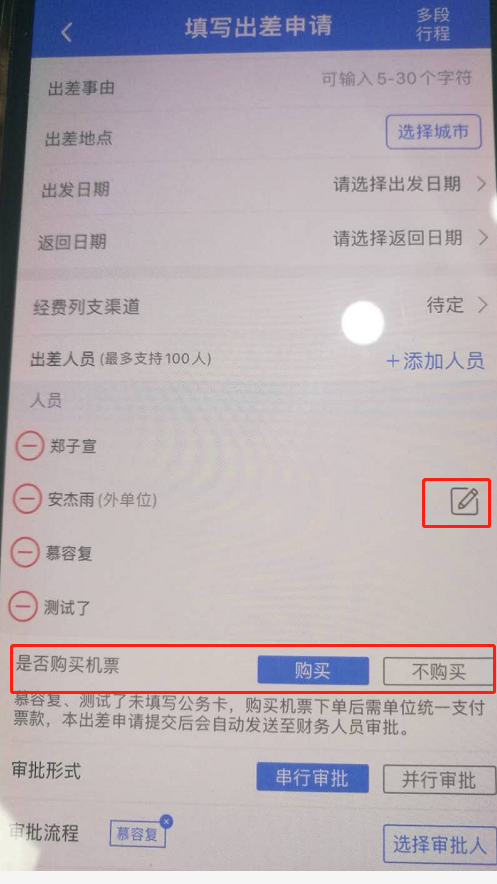

## 1、首页导航

这个是首页相关逻辑的代码类
E:\myjob\appservice\code\android\gwhomeandriod\app\src\main\java\com\tmc\chailvtong\home\fragment
这个是首页用到的布局文件
E:\myjob\appservice\code\android\gwhomeandriod\app\src\main\res\layout\fg_home_index_new.xml

这个方法是首页上的功能导航区点击所触发的事件处理逻辑函数

```javascript
// 出差，报销相关的点击事件
public void clickFuntionOption(HomePageResouseBean.DataBean clickData) {

}
```

## 出差申请单

todo: 1、IsBuyAirTicket 这个字段对应的相关逻辑及界面修改 是否需要审核机票的购买

IsNeedAirTicketFinanceApproval 为true并且所有的出差人都不需要指定交通工具且选中的所有出差人中存在一位无公务卡的情况 就需要在界面上显示



是的情况：
```json
    "ApprovalTrafficSet":{
        "TrafficType":"JP",
        "IsNeedVehicleApproval":false,
        "IsNeedAirTicketFinanceApproval":true,
        "ApproverUserId":127290,
        "ApproverName":"宋梦晨测试"
    }
```
不是的情况
```json
    "ApprovalTrafficSet":{
        "TrafficType":"JP",
        "IsNeedVehicleApproval":false,
        "IsNeedAirTicketFinanceApproval":false,
        "ApproverUserId":138237,
        "ApproverName":"尹东阳公务"
    },
```

LinkApplyOrderNo 外单位出差申请单关联本单位出差申请单号 （之前有这个逻辑，现在没有了）
android 代码里的 applyType 取值有可能为 0 1 2 只有 1 里才表示是外单位人员填写出差申请，这个业务已经废弃了


数据:前端表示已经选中的出差人
```json
  currentSelectedTravellers: [
      {"userId": "177140", "userName": "于成龙", "personalType": 0},
  ]
```

https://www.cnblogs.com/fengff/p/11015639.html
判断两个日期是否有重叠

```javascript
let d1 = {
  sdate: "2010-10-11",
  edate: "2010-10-11",
};
let d2 = {
  sdate: "2010-10-11",
  edate: "2010-10-11",
};
let flag =
  (d1.sdate == d1.edate && d2.sdate == d2.edate && d1.edate == d2.sdate) ||
  (this.moment(d1.sdate).isBefore(d2.edate) &&
    this.moment(d1.sdate).isAfter(d2.sdate));
console.log(flag);
```

提交出差申请时，ConfirmSubmitTripApplyOrder 有两种情况：如果一个出差申请提交后又自己撤回了，再次进入编辑后一种是提交保存（这种情况传 1）一种是只保存不提交(这种情况传 0) 
另外如果从草稿列表中进入编辑界面后，一种是点击保存为草稿，另个一种是点击提交审批（这种情况下已经有了出差申请单号，需要调用更新的接口，而且 ConfirmSubmitTripApplyOrder 这个值也要传1


生成xml方法的形参与实参对应关系
|  形参类型   | 形参名称 | 形参名称  |
|  :----  | :---- | :---- |
|String | rootHeader | requestParamName |
|String|PsgInfoHeader|"PsgInfo"|
|String|PsgInfosHeader|"PsgInfos"|
|List<Map<String, String>>|staffList|staffReqMapList|
|String|MultipleTripHeader|"MultipleTrip"|
|String|MultipleTripHeaders|"MultipleTrips"|
|List<Map<String, String>>|many_businessList|business_applyfor_map_list|
|String|AuditorHeader|"Auditor"|
|String|AuditorsHeader|"Auditors"|
|List<Map<String, String>>|leaderList|leaderReqMapList|
|String|reservationsPsgsHeader|"ReservationsPsgs"|
|String|reservationsPsgsInfoHeader|"ReservationsPsgsInfo"|
|List<Map<String, String>>|resverationReqMapList|resverationReqMapList|
|Map<String, String>|outerMap|rerquestMap|
|List<Map<String, String>>|ARPCustFundsChannelList|ARPCustFundsChannelList|
|List<Map<String, String>>|ticketlList|ticketlList|
|List<MultipleTripsBean>|multiTripList|multiTripList|
|Map<String, String>|verifyCodeMap|verifyCodeMap|

## 2、选择经费列支渠道组件

et_business_travel_fee_channel_item_input

## 3、预订模式

reservationType// 0 全部 1 各自 2 指定

## 4、出差界面相关代码逻辑

E:\myjob\appservice\code\android\gwhomeandriod\app\src\main\res\layout\item_add_many_distance.xml 添加多段行程的每一段行程界面
E:\myjob\appservice\code\android\gwhomeandriod\app\src\main\res\layout\activity_business_travel_apply.xml 添加出差申请单界面

## 5、出差附件管理

E:\myjob\appservice\code\android\gwhomeandriod\app\src\main\java\com\tmc\chailvtong\businesstravel\activity\CheckAnnexListActivity.java 这个文件中的 updateAnnexDesc 方法编辑附件的备注信息 、 deletePic 方法是删除附件的访求

### 5.1 获取附件列表 ApplyOrderNo 或 BatchID 其中之一不能为空

<M_GetTripApplyAnnexList_1_0><ApplyOrderNo></ApplyOrderNo><BatchID>20200916163230_177117</BatchID><VerifyCode>d69f1ad955fc9d43f253def7250de432259c874b81b1600da57acb35f35fb17d</VerifyCode></M_GetTripApplyAnnexList_1_0>

### 5.2 修改附件的备注信息

Request 中的内容是一个对象的 json 序列化后的字符串
<M_UpdateTripApplyAnnexRemark><Request>{"AnnexOnlyID":"1175866-1915453229","Remark":"古古怪怪 aa"}</Request><VerifyCode>a98b72b6f49f84f972bbf7dbe0041eb0e612674e1ed1d23f2af1cf910296a76e</VerifyCode></M_UpdateTripApplyAnnexRemark>

### 5.3 删除附件

<M_DeleteTripApplyAnnex_1_0>
<PKID>31171,31172</PKID>
</M_DeleteTripApplyAnnex_1_0>

### 5.4 附件上传

E:\myjob\appservice\code\android\gwhomeandriod\app\src\main\java\com\tmc\chailvtong\home\model\UploadImageModel.java 这个文件中的 uploadFile 方法

<!-- {"PCode":"530000","CityName":"玉溪市","DisplayName":"玉溪市(云南省)","Name":"玉溪市","Code":"530400"}
{"approverId":"127102","approverName":"胡春林2"} -->

<!--

# 标题1
#### 标题
**abc**
```javascript
function abc(){

}
```
-->
